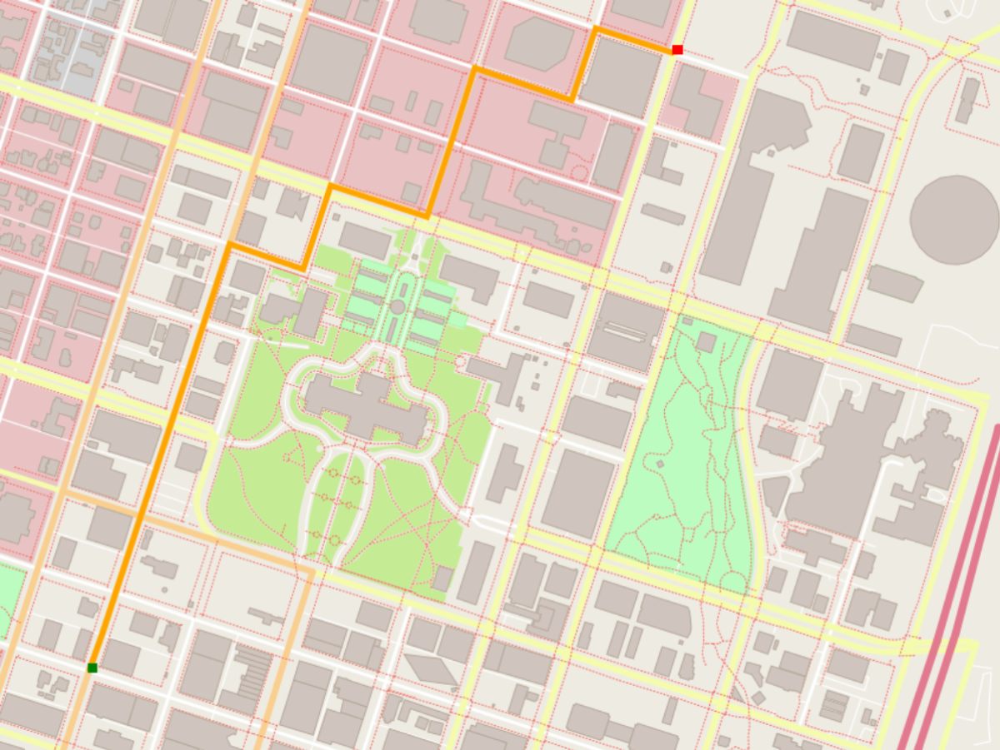

# OpenStreetMap Routing Engine (C++)

A lightweight geospatial routing engine built with C++ using real-world OpenStreetMap (OSM) data.

This project explores how spatial data can be transformed into graph-based routing systems through:
- OpenStreetMap parsing
- spatial graph construction
- A* shortest path search
- route visualization and rendering

The project was originally developed from the Udacity C++ Nanodegree Route Planning project framework and further extended with custom implementations of the A* routing logic and routing pipeline components.




---

## Features

### Geospatial Data Processing
- Parses real OpenStreetMap XML (`.osm`) data
- Converts OSM entities into graph-based spatial structures
- Supports roads, buildings, landuse, water, and railway geometries
- Handles multipolygon topology reconstruction

### Routing Engine
- A* shortest-path search implementation
- Nearest-node lookup for origin/destination snapping
- Graph traversal using heuristic search
- Distance-based routing over road network topology

### Visualization
- 2D rendering pipeline using IO2D
- Dynamic route visualization
- Layered rendering of roads, buildings, landuse, and waterways

### Engineering Concepts
- Modern C++ (STL containers, pointers, references, lambdas)
- Modular architecture
- Graph modeling and traversal
- Spatial coordinate normalization

---

## Example Workflow

```text
OpenStreetMap XML
    ↓
Spatial graph construction
    ↓
A* pathfinding
    ↓
Route generation
    ↓
2D rendering
```

---

## Project Structure

```text
openstreetmap_route_planner/

src/
├── main.cpp
├── model.cpp
├── route_model.cpp
├── route_planner.cpp
├── render.cpp

test/
├── utest_rp_a_star_search.cpp

map.osm
map.png
README.md
```

---

## Core Components

### `Model`
Parses raw OpenStreetMap XML data and converts it into structured geospatial entities.

### `RouteModel`
Builds a graph abstraction on top of the parsed map data for routing operations.

### `RoutePlanner`
Implements the A* shortest-path search algorithm.

### `Render`
Responsible for map visualization and route rendering using IO2D.

---

## GeoJSON Export (Planned)

Planned future improvements include:
- GeoJSON route export
- travel-time-based routing costs
- speed-limit-aware edge weights
- spatial indexing (KD-tree / R-tree)
- routing performance benchmarking

---

## Cloning

The starter codes are in 'https://github.com/udacity/CppND-Route-Planning-Project.git'.
When cloning this project, be sure to use the `--recurse-submodules` flag. Using HTTPS:
```
git clone https://github.com/udacity/CppND-Route-Planning-Project.git --recurse-submodules
```
or with SSH:
```
git clone git@github.com:udacity/CppND-Route-Planning-Project.git --recurse-submodules
```

## Dependencies for Running Locally
* cmake >= 3.11.3
  * All OSes: [click here for installation instructions](https://cmake.org/install/)
* make >= 4.1 (Linux, Mac), 3.81 (Windows)
  * Linux: make is installed by default on most Linux distros
  * Mac: [install Xcode command line tools to get make](https://developer.apple.com/xcode/features/)
  * Windows: [Click here for installation instructions](http://gnuwin32.sourceforge.net/packages/make.htm)
* gcc/g++ >= 7.4.0
  * Linux: gcc / g++ is installed by default on most Linux distros
  * Mac: same instructions as make - [install Xcode command line tools](https://developer.apple.com/xcode/features/)
  * Windows: recommend using [MinGW](http://www.mingw.org/)
* IO2D
  * Installation instructions for all operating systems can be found [here](https://github.com/cpp-io2d/P0267_RefImpl/blob/master/BUILDING.md)
  * This library must be built in a place where CMake `find_package` will be able to find it

## Compiling and Running

### Compiling
To compile the project, first, create a `build` directory and change to that directory:
```
mkdir build && cd build
```
From within the `build` directory, then run `cmake` and `make` as follows:
```
cmake ..
make
```
### Running
The executable will be placed in the `build` directory. From within `build`, you can run the project as follows:
```
./OSM_A_star_search
```
Or to specify a map file:
```
./OSM_A_star_search -f ../<your_osm_file.osm>
```

## Testing

The testing executable is also placed in the `build` directory. From within `build`, you can run the unit tests as follows:
```
./test
```
---

## Acknowledgements

This project is based on the Udacity C++ Nanodegree Route Planning project framework:
- OpenStreetMap parsing framework
- rendering infrastructure
- project architecture scaffold

Custom implementations and extensions include:
- A* routing logic
- graph traversal modules
- path construction pipeline
- routing integration workflow


